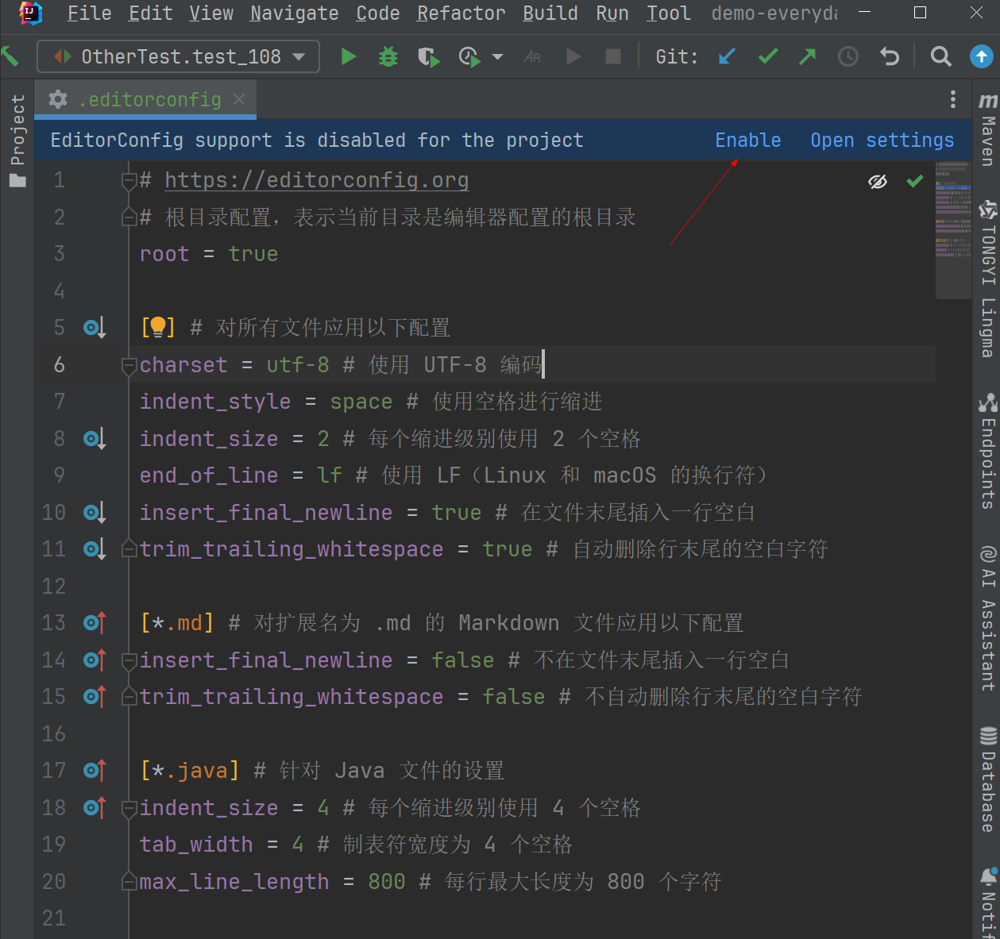

# editorconfig 代码编辑器配置

目的：保持代码风格一致。

项目目录下新建配置文件 `.editorconfig`

配置示例：

```
# https://editorconfig.org
# 根目录配置，表示当前目录是编辑器配置的根目录
root = true

[*] # 对所有文件应用以下配置
charset = utf-8 # 使用 UTF-8 编码
indent_style = space # 使用空格进行缩进
indent_size = 2 # 每个缩进级别使用 2 个空格
end_of_line = lf # 使用 LF（Linux 和 macOS 的换行符）
insert_final_newline = true # 在文件末尾插入一行空白
trim_trailing_whitespace = true # 自动删除行末尾的空白字符

[*.md] # 对扩展名为 .md 的 Markdown 文件应用以下配置
insert_final_newline = false # 不在文件末尾插入一行空白
trim_trailing_whitespace = false # 不自动删除行末尾的空白字符

[*.java] # 针对 Java 文件的设置
indent_size = 4 # 每个缩进级别使用 4 个空格
tab_width = 4 # 制表符宽度为 4 个空格
max_line_length = 800 # 每行最大长度为 800 个字符
```

开启配置


