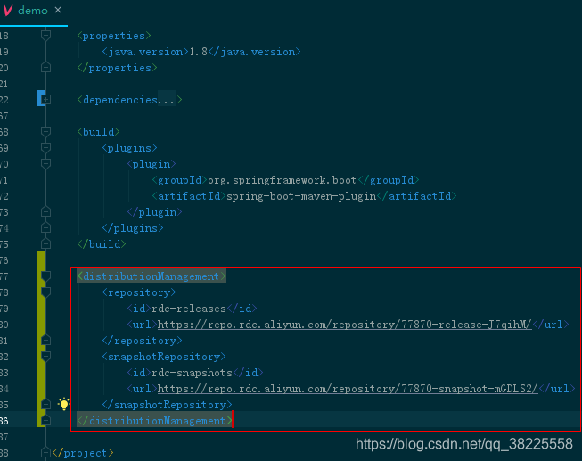
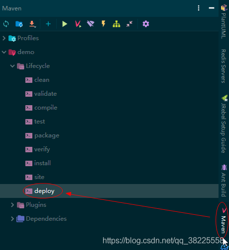
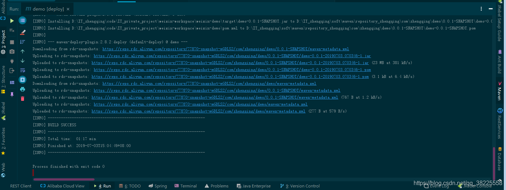

### 一、前言

> tips: 需阿里云账号
> 搭建私有Maven仓库见：https://helpcdn.aliyun.com/document_detail/57890.html

### 二、使用demo讲解

> 云效上面的教程非常简单，直接根据上面的来就好，下面也给出小编的操作流程。

#### 1、进入云效私有仓库：https://repomanage.rdc.aliyun.com/my/repo


#### 2、配置本地maven -> settings.xml

这里可以直接下载云效上提供的配置文件，比较方便！

下载完拷贝到自己maven的安装目录下替换即可，有需要的可以在添加如下配置本地仓库目录

```xml
<!-- 本地仓库的配置【注：这里换成自己的目录】 -->
<localRepository>D:\IT_zhengqing\soft\maven\repository_zhengqing</localRepository>
```


#### 3、配置项目pom文件



#### 4、打包发布到云效私有仓库

##### 方式一：使用云效提供的命令

```
mvn clean deploy -DskipTests
```

##### 方式二：idea-maven图形化工具 -> 双击deploy


如下成功之后，即可到云效中查看发布信息

> 温馨小提示：这里最好不要拿空项目去测试上传，小编刚开始第一次因为是测试，所以直接拿的一个只有输出语句的项目上传，结果到云效中看不到任何信息，deploy的时候如果有显示Uploading这种信息一般就是对的操作！
> 



#### 5、到云效私有仓库查看信息

> **温馨小提示**：maven中的仓库分为两种，snapshot快照仓库和release发布仓库。snapshot快照仓库用于保存开发过程中的不稳定版本，release正式仓库则是用来保存稳定的发行版本。
> 这里小编是推送到快照库中，所以应该选择快照库查看jar信息！
> 


上传完之后，对应就可以在项目中引入相应的依赖使用了~

其次我们也可以在云效搜索制品哦~

