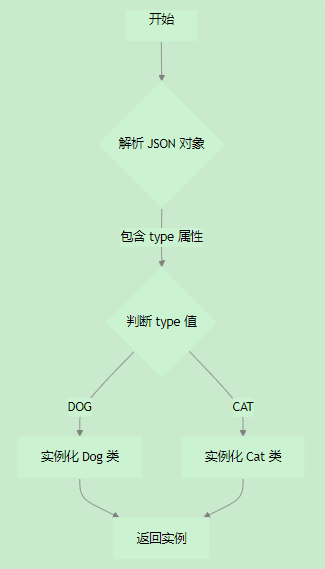

# Jackson 多态反序列化

`@JsonTypeInfo` 和 `@JsonSubTypes` 是 Jackson 库中用于处理多态类型序列化和反序列化的注解。

它们通常一起使用，以确保在 JSON 数据中包含足够的信息来正确地反序列化为具体的子类。




### 作用

1. **@JsonTypeInfo**:
    - 用于指定如何在 JSON 中包含类型信息。
    - `use`：指定包含类型信息的方式，例如 `JsonTypeInfo.Id.NAME` 表示使用类名作为类型标识。
    - `include`：指定类型信息包含的位置，例如 `JsonTypeInfo.As.EXISTING_PROPERTY` 表示将类型信息嵌入到现有属性中。
    - `property`：指定类型信息存储在哪一个属性中，例如`type` 表示将类型信息存储在名为type的属性字段中。
    - `visible`：指定类型信息在序列化后的JSON中是否可见，例如 `true` 表示可见。

2. **@JsonSubTypes**:
    - 用于指定父类可能的子类及其对应的 JSON 类型标识。
    - 通过 `@JsonSubTypes.Type` 注解来定义每个子类及其对应的类型标识。

### 代码示例

假设我们有一个父类 `Animal` 和两个子类 `Dog` 和 `Cat`，我们希望在序列化和反序列化时能够正确处理这些类。

```java
import com.fasterxml.jackson.annotation.JsonSubTypes;
import com.fasterxml.jackson.annotation.JsonTypeInfo;

@JsonTypeInfo(
        use = JsonTypeInfo.Id.NAME,
        include = JsonTypeInfo.As.EXISTING_PROPERTY,
        property = "type",
        visible = true
)
@JsonSubTypes({
        @JsonSubTypes.Type(value = Dog.class, name = "DOG"),
        @JsonSubTypes.Type(value = Cat.class, name = "CAT")
})
public abstract class Animal {
    private String name;

    // getters and setters
}

public class Dog extends Animal {
    private String breed;

    // getters and setters
}

public class Cat extends Animal {
    private boolean isIndoor;

    // getters and setters
}
```

在这个例子中：

- `@JsonTypeInfo` 注解指定了在 JSON 中使用 `type` 属性来存储类型信息。
- `@JsonSubTypes` 注解列出了 `Animal` 的两个子类 `Dog` 和 `Cat`，并指定了它们在 JSON 中对应的名称。

#### 序列化示例

```java
import com.fasterxml.jackson.databind.ObjectMapper;

public class Main {
    public static void main(String[] args) throws Exception {
        ObjectMapper mapper = new ObjectMapper();

        Dog dog = new Dog();
        dog.setName("Buddy");
        dog.setBreed("Golden Retriever");

        Cat cat = new Cat();
        cat.setName("Whiskers");
        cat.setIndoor(true);

        String dogJson = mapper.writeValueAsString(dog);
        String catJson = mapper.writeValueAsString(cat);

        System.out.println(dogJson);  // 输出: {"type":"dog","name":"Buddy","breed":"Golden Retriever"}
        System.out.println(catJson);  // 输出: {"type":"cat","name":"Whiskers","isIndoor":true}
    }
}
```

#### 反序列化示例

```java
import com.fasterxml.jackson.databind.ObjectMapper;

public class Main {
    public static void main(String[] args) throws Exception {
        ObjectMapper mapper = new ObjectMapper();

        String dogJson = "{\"type\":\"dog\",\"name\":\"Buddy\",\"breed\":\"Golden Retriever\"}";
        String catJson = "{\"type\":\"cat\",\"name\":\"Whiskers\",\"isIndoor\":true}";

        Animal dog = mapper.readValue(dogJson, Animal.class);
        Animal cat = mapper.readValue(catJson, Animal.class);

        System.out.println(dog.getClass().getSimpleName());  // 输出: Dog
        System.out.println(cat.getClass().getSimpleName());  // 输出: Cat
    }
}
```

通过这种方式，Jackson 可以根据 JSON 中的 `type` 属性正确地将数据反序列化为 `Dog` 或 `Cat` 对象。

---

### 完整案例demo

```java
import cn.hutool.json.JSONUtil;
import com.fasterxml.jackson.annotation.JsonSubTypes;
import com.fasterxml.jackson.annotation.JsonTypeInfo;
import com.fasterxml.jackson.databind.ObjectMapper;
import lombok.*;
import lombok.experimental.SuperBuilder;
import org.junit.Test;

/**
 * <p> jackson 多态反序列化 </p>
 *
 * @author zhengqingya
 * @description
 * @date 2024/12/25 15:23
 */
public class JsonTypeInfoTest {
    @Test
    public void test_serialize() throws Exception {
        // 序列化
        ObjectMapper mapper = new ObjectMapper();

        Dog dog = new Dog();
        dog.setType(AnimalTypeEnum.DOG);
        dog.setBreed("Golden Retriever");

        Cat cat = new Cat();
        cat.setType(AnimalTypeEnum.CAT);
        cat.setIndoor(true);

        String dogJson = mapper.writeValueAsString(dog);
        String catJson = mapper.writeValueAsString(cat);

        System.out.println(dogJson);  // 输出: {"type":"DOG","breed":"Golden Retriever"}
        System.out.println(catJson);  // 输出: {"type":"CAT","indoor":true}
    }

    @Test
    public void test_deserialize() throws Exception {
        // 反序列化
        ObjectMapper mapper = new ObjectMapper();

        String dogJson = "{\"type\":\"DOG\",\"breed\":\"Golden Retriever\"}";
        String catJson = "{\"type\":\"CAT\",\"indoor\":true}";

        Animal dog = mapper.readValue(dogJson, Animal.class);
        Animal cat = mapper.readValue(catJson, Animal.class);

        System.out.println(dog.getClass().getSimpleName());  // 输出: Dog
        System.out.println(JSONUtil.toJsonStr(dog)); // 输出: {"breed":"Golden Retriever","type":"DOG"}
        System.out.println(cat.getClass().getSimpleName());  // 输出: Cat
        System.out.println(JSONUtil.toJsonStr(cat)); // 输出: {"isIndoor":true,"type":"CAT"}
    }
}


@Data
@SuperBuilder
@NoArgsConstructor
@AllArgsConstructor
@JsonTypeInfo(
        use = JsonTypeInfo.Id.NAME,
        include = JsonTypeInfo.As.EXISTING_PROPERTY,
        property = "type",
        visible = true
)
@JsonSubTypes({
        @JsonSubTypes.Type(value = Dog.class, name = "DOG"),
        @JsonSubTypes.Type(value = Cat.class, name = "CAT")
})
abstract class Animal {
    private AnimalTypeEnum type;
}

@Data
@SuperBuilder
@NoArgsConstructor
@AllArgsConstructor
@EqualsAndHashCode(callSuper = true)
class Dog extends Animal {
    private String breed;
}

@Data
@SuperBuilder
@NoArgsConstructor
@AllArgsConstructor
@EqualsAndHashCode(callSuper = true)
class Cat extends Animal {
    private boolean isIndoor;
}

@AllArgsConstructor
@Getter
enum AnimalTypeEnum {
    DOG, CAT;
}
```
