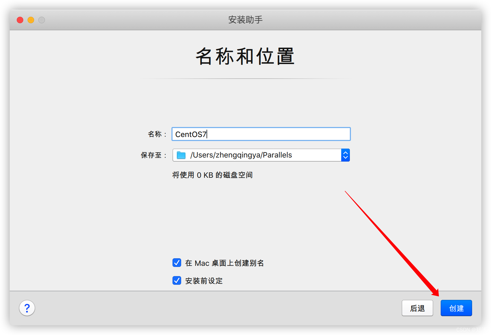
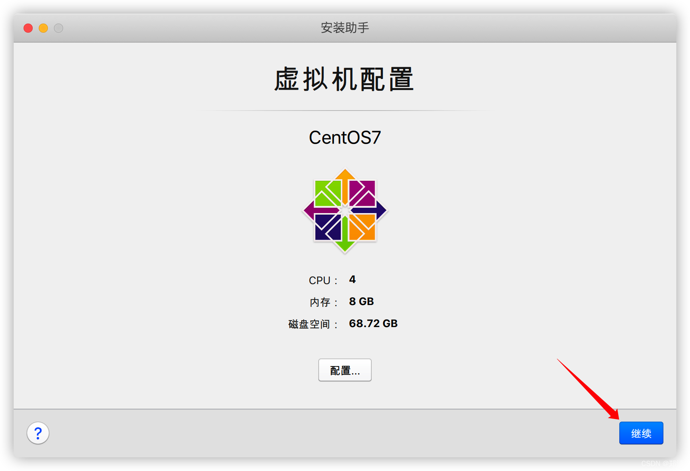
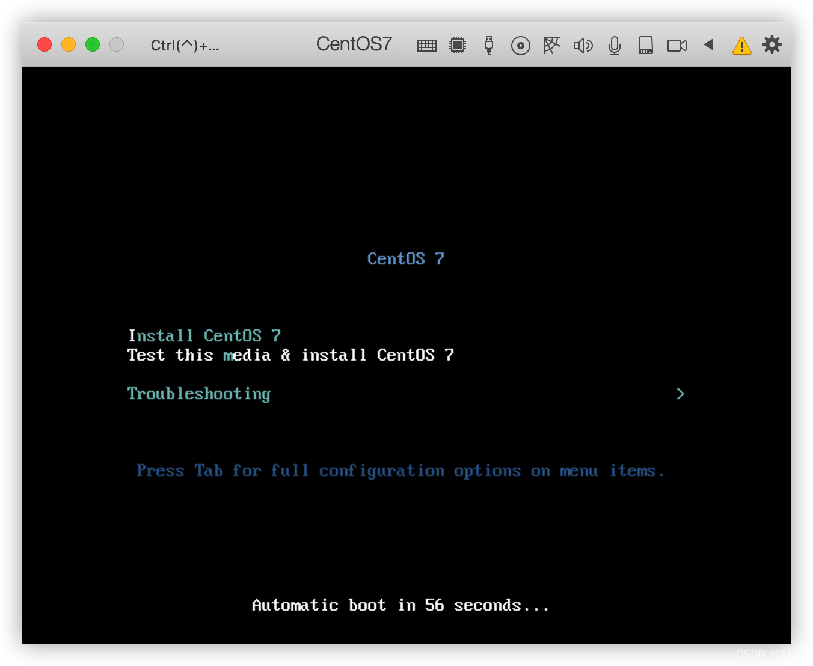
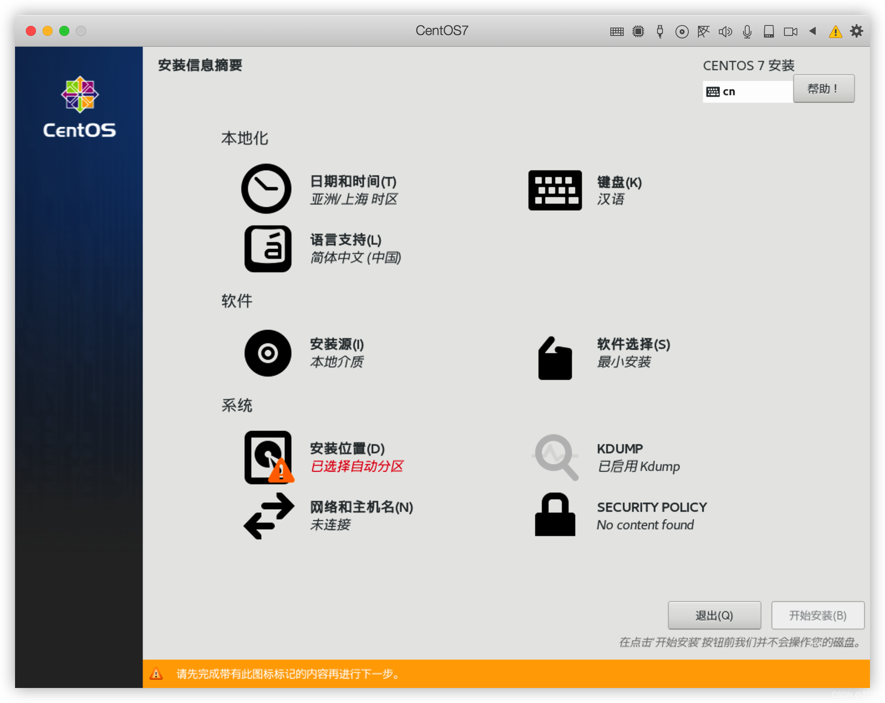
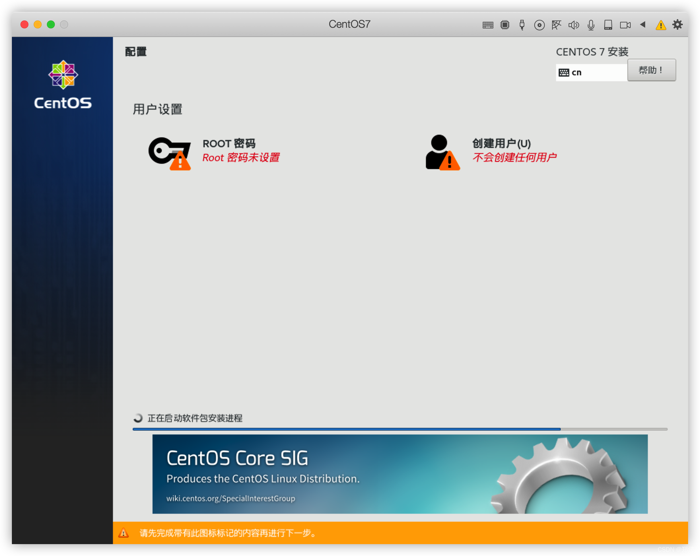
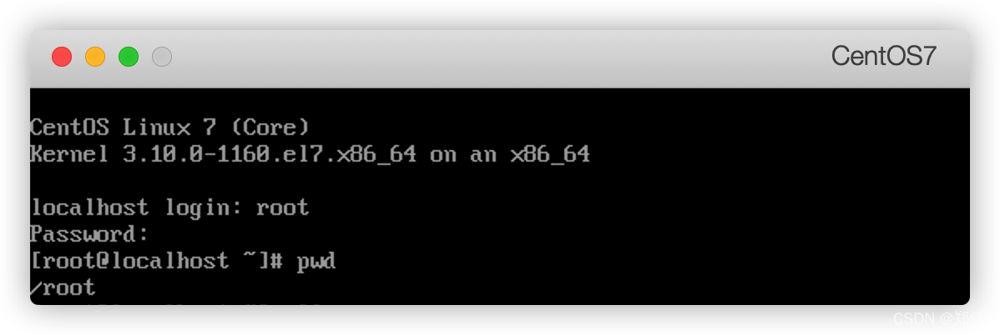
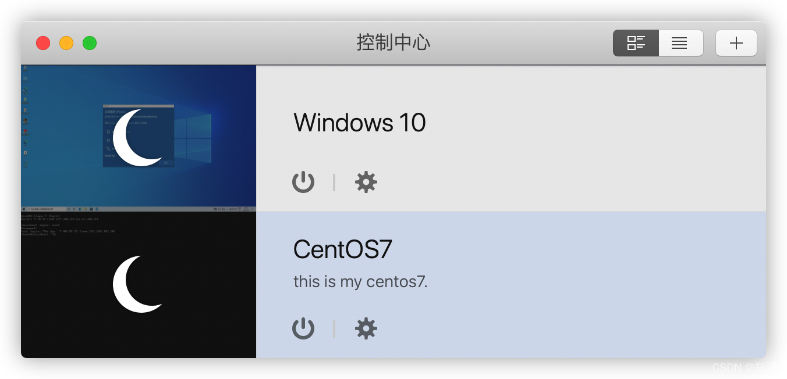
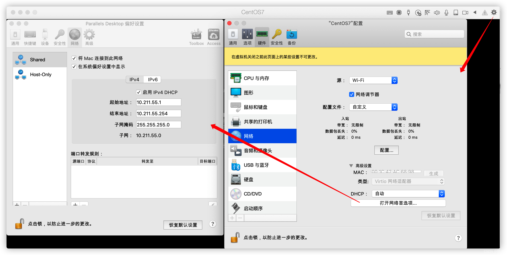
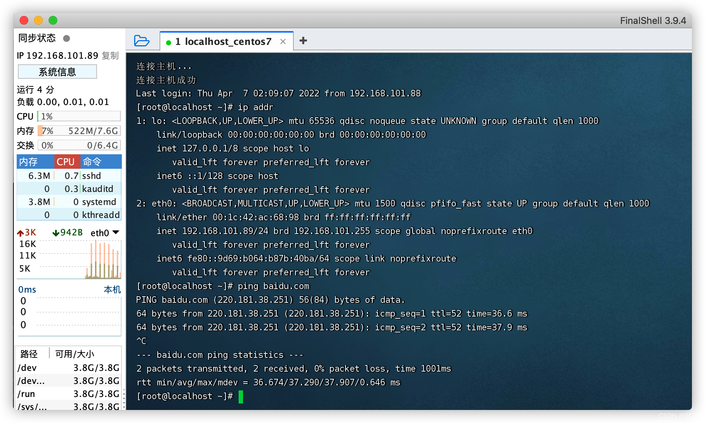

@[TOC](文章目录)

### 一、前言

本文将通过`Parallels Desktop`安装`CentOS7`

### 二、准备

1. Parallels Desktop下载安装 [https://www.parallels.cn/products/desktop/download](https://www.parallels.cn/products/desktop/download)
2. CentOS的iso镜像下载 [https://www.centos.org/download](https://www.centos.org/download)

### 三、`Parallels Desktop`安装`CentOS7`



虚拟机配置

这里根据自己的条件分配即可~





安装位置配置


设置密码



登录，完成安装~




### 四、CentOS7配置

#### 1、网络配置  -- 设置固定ip

查看虚拟机网络


```shell
# 设置固定ip
vi /etc/sysconfig/network-scripts/ifcfg-eth0
```

配置修改示例

```shell
TYPE="Ethernet"
PROXY_METHOD="none"
BROWSER_ONLY="no"
# ip设置为静态：dhcp改成static
BOOTPROTO="static"
DEFROUTE="yes"
IPV4_FAILURE_FATAL="no"
IPV6INIT="yes"
IPV6_AUTOCONF="yes"
IPV6_DEFROUTE="yes"
IPV6_FAILURE_FATAL="no"
IPV6_ADDR_GEN_MODE="stable-privacy"
NAME="eth0"
UUID="0d0685a9-4432-443d-9906-c95e89dd2cf8"
# 网卡名
DEVICE="eth0"
# no改成yes
ONBOOT="yes"
# 网关
GATEWAY="192.168.101.1"
# 设置ip地址
IPADDR="192.168.101.89"
# 子网掩码
NETMASK="255.255.255.0"
DNS1="114.114.114.114"
DNS2="8.8.8.8"
ZONE="public"
```

```shell
# 重启网络
# systemctl restart network
# 重启
reboot
# 查看ip
ip addr
```




#### 2、关闭防火墙

```shell
# firewalld的基本使用
# 启动
systemctl start firewalld
# 关闭
systemctl stop firewalld
# 查看状态
systemctl status firewalld 
# 开机禁用
systemctl disable firewalld
# 开机启用
systemctl enable firewalld
```

#### 3、关闭SELinux

```shell
# 查看SELinux状态
getenforce

# 临时关闭SELinux
setenforce 0

# 永久关闭SELinux
vim /etc/selinux/config
# 将 `SELINUX=enforcing` 改成 `SELINUX=disabled`

# 重启
reboot
```

#### 4、更新yum源

> 解决yum安装依赖报错   `cannot find a valid baseurl for repo: base/7/x86_64`

```shell
cd /etc/yum.repos.d
mkdir repo_bak
# 备份配置
mv *.repo repo_bak/

# 下载新的 CentOS-Base.repo 到 /etc/yum.repos.d/
wget http://mirrors.aliyun.com/repo/Centos-7.repo

# 安装EPEL（Extra Packages for Enterprise Linux ）源  -- tips:如果这里安装不了，可尝试先清除缓存重新生成新的缓存
# yum clean all
# yum makecache
yum install -y epel-release

# 清除缓存
yum clean all
# 生成新的缓存
yum makecache

# 查看启用的yum源和所有的yum源
yum repolist enabled
yum repolist all

# 更新yum
yum -y update
```

#### 5、安装ifconfig

```shell
# 安装ifconfig命令
yum install net-tools.x86_64
# 查看ip
ifconfig
```

#### 6、其它

```shell
# 安装wget
yum install wget
# 安装git
yum install git
```


---

题外话：在配置centos网络问题时，遇到了一点小问题，导致弄到凌晨2点过，果真大晚上不适合熬夜搞。这遇到问题搞不出来睡不着觉的小性格也是难搞哦 哈哈 `^_^`，以后还是多爱自己一点点吧，加油，年轻人！


--- 

> 今日分享语句：
> 鸡蛋，从外打破是食物，从内打破是生命，人生也是如此，从外打破是压力，从内打破是成长。
