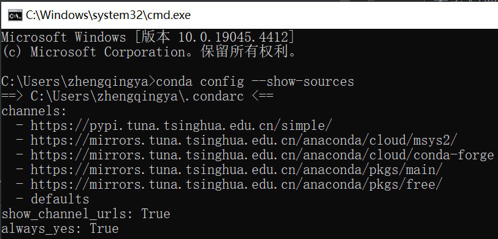

# 配置镜像加速

> https://docs.conda.io/projects/conda/en/stable/user-guide/configuration/use-condarc.html

查看配置文件 `C:\Users\zhengqingya\.condarc`

```shell
# 查看配置文件所在路径
conda config --show-sources
```




### 方式一：命令行

```shell
# 查看配置
conda config --show channels

# 添加4个新的channels
conda config --add channels https://mirrors.tuna.tsinghua.edu.cn/anaconda/pkgs/free/
conda config --add channels https://mirrors.tuna.tsinghua.edu.cn/anaconda/pkgs/main/
conda config --add channels https://mirrors.tuna.tsinghua.edu.cn/anaconda/cloud/conda-forge 
conda config --add channels https://mirrors.tuna.tsinghua.edu.cn/anaconda/cloud/msys2/
# 显示包的安装来源
conda config --set show_channel_urls yes
# 包安装跳过【y/n】
conda config --set always_yes yes

# 如果不需要，配置错了，可进行移除操作
# conda config --remove channels https://mirrors.tuna.tsinghua.edu.cn/anaconda/pkgs/free/
# 移除defaults
# conda config --remove channels defaults
```

### 方式二：配置文件 - 清华镜像

参考 https://mirrors.tuna.tsinghua.edu.cn/help/anaconda

修改配置文件 `C:\Users\zhengqingya\.condarc`

```yml
channels:
  - defaults
show_channel_urls: true
default_channels:
  - https://mirrors.tuna.tsinghua.edu.cn/anaconda/pkgs/main
  - https://mirrors.tuna.tsinghua.edu.cn/anaconda/pkgs/r
  - https://mirrors.tuna.tsinghua.edu.cn/anaconda/pkgs/msys2
custom_channels:
  conda-forge: https://mirrors.tuna.tsinghua.edu.cn/anaconda/cloud
  msys2: https://mirrors.tuna.tsinghua.edu.cn/anaconda/cloud
  bioconda: https://mirrors.tuna.tsinghua.edu.cn/anaconda/cloud
  menpo: https://mirrors.tuna.tsinghua.edu.cn/anaconda/cloud
  pytorch: https://mirrors.tuna.tsinghua.edu.cn/anaconda/cloud
  pytorch-lts: https://mirrors.tuna.tsinghua.edu.cn/anaconda/cloud
  simpleitk: https://mirrors.tuna.tsinghua.edu.cn/anaconda/cloud
# 包安装跳过【y/n】
always_yes: true
```

```shell
# 清除索引缓存，保证用的是镜像站提供的索引。
conda clean -i

# 测试
conda create -n my_env_name python=3.9.7 numpy flask
```