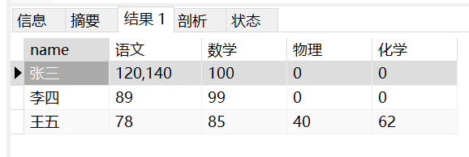

DDL

```
CREATE TABLE `t_test_row_to_col` (
  `id` int(11) NOT NULL AUTO_INCREMENT,
  `name` varchar(255) DEFAULT NULL,
  `course` varchar(255) DEFAULT NULL,
  `score` int(11) DEFAULT NULL,
  `time` datetime DEFAULT CURRENT_TIMESTAMP,
  PRIMARY KEY (`id`)
) ENGINE=InnoDB AUTO_INCREMENT=24 DEFAULT CHARSET=utf8mb4;
```

DML

```
insert into t_test_row_to_col(name,course,score) values ('张三','语文',120);
insert into t_test_row_to_col(name,course,score) values ('张三','数学',100);
insert into t_test_row_to_col(name,course,score) values ('张三','英语',82);
insert into t_test_row_to_col(name,course,score) values ('李四','语文',89);
insert into t_test_row_to_col(name,course,score) values ('李四','数学',99);
insert into t_test_row_to_col(name,course,score) values ('李四','英语',87);
insert into t_test_row_to_col(name,course,score) values ('王五','语文',78);
insert into t_test_row_to_col(name,course,score) values ('王五','数学',85);
insert into t_test_row_to_col(name,course,score) values ('王五','英语',145);
insert into t_test_row_to_col(name,course,score) values ('王五','物理',40);
insert into t_test_row_to_col(name,course,score) values ('王五','化学',62);
```

###### 场景1：每个人下的类型数据仅一条

DQL

> tips: `IFNULL(GROUP_CONCAT(xx, 默认值) as 字段名` 仅适用于每个用户的行类型只有1条数据，不存在多条数据（eg：张三的语文成绩有多条情况）。

```
SELECT
    name,
    IFNULL(GROUP_CONCAT( CASE WHEN course = '语文'  THEN score END), 0 )  AS 语文,
    IFNULL(GROUP_CONCAT( CASE WHEN course = '数学'  THEN score END), 0 )  AS 数学,
    IFNULL(GROUP_CONCAT( CASE WHEN course = '物理'  THEN score END), 0 )  AS 物理,
    IFNULL(GROUP_CONCAT( CASE WHEN course = '化学'  THEN score END), 0 )  AS 化学
FROM t_test_row_to_col
GROUP BY name;
```

结果：


###### 场景2：每个人下的类型数据存在多条

DML

```
-- 再插入一条数据 -- 此时张三的语文成绩有多条
insert into t_test_row_to_col(name,course,score) values ('张三','语文',140);
```

如果有多条的情况下，上面sql结果：


解决：可以先拿到最新时间的数据，再进行分组。

DQL

```
SELECT
    t1.name,
    IFNULL(GROUP_CONCAT( CASE WHEN t1.course = '语文'  THEN t1.score END), 0 )  AS 语文,
    IFNULL(GROUP_CONCAT( CASE WHEN t1.course = '数学'  THEN t1.score END), 0 )  AS 数学,
    IFNULL(GROUP_CONCAT( CASE WHEN t1.course = '物理'  THEN t1.score END), 0 )  AS 物理,
    IFNULL(GROUP_CONCAT( CASE WHEN t1.course = '化学'  THEN t1.score END), 0 )  AS 化学
FROM t_test_row_to_col t1
JOIN (
    SELECT name, course, MAX(id) AS max_id, score
    FROM t_test_row_to_col
    GROUP BY name,course
) t2 ON t1.name = t2.name AND t1.course = t2.course AND t1.id = t2.max_id
GROUP BY t1.name;
```


