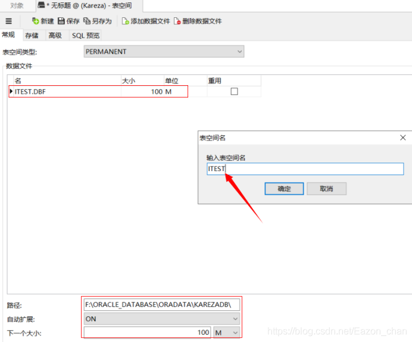
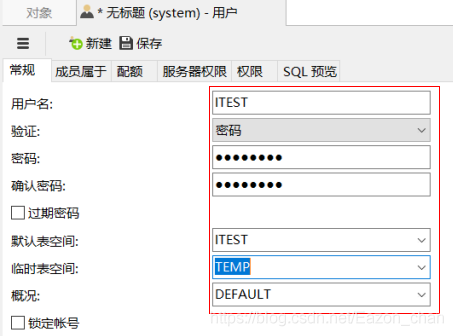

# Navicat 创建 Oracle数据库.md

# 前言

其实在Oracle中的概念并不是创建数据库，而是创建一个表空间，然后再创建一个用户，设置该用户的默认表空间为我们新创建的表空间，这些操作之后，便和你之前用过的mysql数据库创建完数据库一模一样了（如果你用过mysql的话，当然如果Oracle是你用的第一个数据库系统，那上面这段话其实看不看并不重要）。
但是，鉴于很多用过mysql的用户，在刚开始使用Oracle的时候都会不知道如何创建数据库，觉得很茫然，然后开始百度、CSDN一通搜索“Oracle如何创建数据库”，所以笔者把本文的题目写成“Navicat for oracle创建数据库”应该也无可厚非。

# Navicat

Navicat是一款很不错的数据库可视化界面，有for mysql版本的，也有for oracle版本的，因为笔者原来使用mysql时便一直在用这一款数据库可视化界面软件，所以本文也是在Navicat的基础上写的。如果你还没有安装Navicat并且想要安装，可以转到笔者的“破解Navicat for oracle”，传送门：[点此](https://blog.csdn.net/Eazon_chan/article/details/88914876)

# 创建数据库

使用Oracle默认账户“system”或者自己的账户连接Oracle

新建一个表空间

创建的表空间如下
（建议开启自动扩展）

到数据库数据存放目录下会看到自己创建的DBF文件

创建一个新用户

设置信息如下
（**！！注意用户名需要设置为全大写英文字母！！**）
（否则在后面连接用户时会出现“用户名或者密码无效”的错误，笔者猜想应该时Oracle在创建用户名是没有要求，但在连接用户是却对用户名进行了检查，所以造成无法连接）
默认表空间设置为刚刚新建的表空间

为该用户设置“成员属于”

设置“服务器权限”

至此，数据库已经创建完毕了
接下来只需要登陆刚刚新建的用户
就可以连接到新配置的表空间

# 连接验证

根据刚刚配置的用户信息连接用户

打开连接，打开模式，即可以看到和mysql创建完数据库基本一致的界面，
可以新建表，也可以新建视图等等
